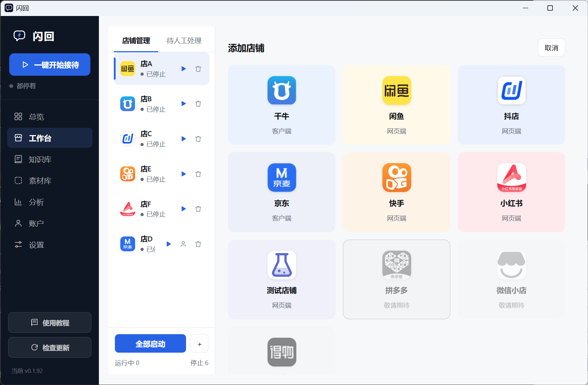
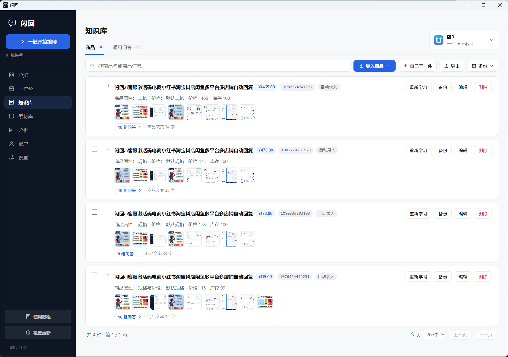

<div align="center">

# 闪回 · 电商 AI 客服机器人

**让 AI 替你守着店铺的每一条消息**

千牛（淘宝 / 天猫）、闲鱼、抖店（飞鸽）、京东（京麦 / 咚咚）、快手小店、小红书商家 - **六个平台、多店铺统一接待**。

AI 先把你店里的商品学一遍再开口：自动回复买家咨询、商品答疑、规格参数、发货与售后，答不准的自动转人工。

<sub>Multi-platform AI customer service bot for Chinese e-commerce — Taobao / Qianniu, Xianyu (Goofish), Douyin Shop, JD, Kuaishou, Xiaohongshu. Windows desktop app.</sub>

[官网与下载](https://shanhui.org/) · [使用教程](https://shanhui.org/tech.html) · [招募代理](#招募代理)

</div>

## 招募代理

**给有创业想法的人一个提案：别重复做一遍，直接卖。**

闪回按**货源分销**模式做渠道，不是提成制。

### 怎么运作

```
你在我们的淘宝货源店拍下一批【提货码】（批发价）
        ↓
在销售后台输入提货码，换出【激活码】
        ↓
你按自己定的价卖给商家（淘宝卡密自动发货 / 私域 / 线下都行）
        ↓
商家在软件里兑换激活码，额度到账
```


---

## 它和「自动回复机器人」的区别

关键词自动回复的问题是：买家换个说法就答不上来，而店主要为每个可能的问法预设一条规则。

闪回的做法是**先学商品**——从你的店铺后台把商品资料、规格表、详情图读下来，逐件交给 AI 学一遍，之后它按你店里的真实资料回答。

- 答案有依据：回的是你商品页上写的东西，不是模型编的
- **答不准它会说不确定**，然后把这条对话交给你，而不是硬答
- 学完的商品可以随时重学（改了价格、换了规格表）

https://github.com/user-attachments/assets/a24e2adb-258a-4e9d-8be2-cb936e7060a3

<sub>买家在闲鱼提问，AI 按商品资料自动回复，需要时转人工 · 完整演示也在 <a href="https://shanhui.org/">官网首页</a></sub>

---

## 支持哪些平台

| 平台 | 接待买家 | 商品采集 | 发图/视频 |
|---|:-:|:-:|:-:|
| **淘宝 / 天猫** · 千牛 | ✅ | ✅ | ✅ |
| **闲鱼** · 咸鱼 | ✅ | ✅ | ✅ |
| **抖店** · 抖音小店 / 飞鸽 | ✅ | ✅ | ✅ |
| **京东** · 京麦 / 咚咚 | ✅ | ✅ | ✅ |
| **快手小店** · 快手电商 | ✅ | ✅ | ✅ |
| **小红书** · 小红书商家 / 千帆 | ✅ | ✅ | ✅ |

---

## 三步用起来

### 1. 添加店铺，在自己电脑上登录

网页平台在软件里内嵌登录；千牛、京麦直接接管你已经装好的客户端。一台电脑可以管多家店。

> **账号始终在你自己手上。** 闪回不代持、不上传你的店铺账号密码，登录动作由你本人在软件里的内嵌页面完成。



### 2. 导入商品，让 AI 学一遍

从店铺后台读商品列表 → 选要学的 → AI 逐件学习，规格表、参数表按品类自动识别，详情图一起交给 AI 看。



### 3. 选接待方式，开始

两种模式，随时切：

| 模式 | 适合 | 行为 |
|---|---|---|
| **AI 全托管** | 夜间、节假日、无人值守 | AI 接管所有咨询，不转人工 |
| **人机协作**（默认） | 你在电脑前 | AI 接常规问题，其余自动转人工进「待处理」队列 |

人机协作下可以按条件自动转人工：买家发来图片、要改地址、售后问题、订单备注、知识库没命中、AI 自己拿不准、命中你设的触发词……每一项单独开关。也能按时段自动排班。

---

## 核心能力

**接待**
- 7×24 小时在线，不掉线
- 会发图、发视频——买家问细节，AI 直接把对应的商品图或实拍视频发过去
- 同一次回答会分段发送，像人一样顿一下再回
- 死循环保护：同一句话不会对同一个买家重复发
- 多店一个工作台：谁在等回复、AI 答了什么、哪条要人管，一眼看全

**知识库**
- 商品资料、规格表、详情图，按品类自动识别（不写死服装尺码这类专属字段）
- 素材库：一件商品的图和视频归到一起，AI 按需取用
- 问答可以手工增删改——AI 学出来的不满意，你自己改
- **知识库存在你自己的电脑上**，可以备份和还原

**安全**
- 两层内容检查：
  - **你自己的敏感词表**（出厂带七个词，可增删）——命中就整条不发，转人工
  - **平台红线**（诱导站外私聊、私下转账这类）——由服务器拦，拦下的这一次**不扣额度**
- 转人工时买家会收到一句垫话，不会干等

---

## 联系

- 官网：<https://shanhui.org/>
- 使用教程：<https://shanhui.org/tech.html>
- QQ 客服：扫官网页脚的二维码
- 代理合作：扫官网页脚的二维码

---

<sub>
电商AI客服 · AI客服系统 · AI客服机器人 · 智能客服 · 客服机器人 · 自动回复软件 · 多平台客服 · 多店铺统一接待 ·
千牛自动回复 · 淘宝AI客服 · 天猫自动回复 · 闲鱼自动回复 · 咸鱼自动回复 · 抖店客服 · 抖音小店自动回复 · 飞鸽自动回复 ·
京东客服 · 京麦自动回复 · 咚咚客服 · 快手小店客服 · 小红书客服 · 千帆客服 ·
AI商品答疑 · 知识库客服 · 自动转人工 · 夜间值守 · 无人值守客服 · 电商客服外包替代 ·
AI customer service · e-commerce chatbot · Taobao Qianniu auto reply · Xianyu / Goofish auto reply · Douyin shop chatbot · JD Kuaishou Xiaohongshu customer service bot
</sub>
